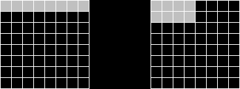

This is an animation of the mapping from an 8x8 grid to the Hilbert path version.

It can be a little confusing to track the Hilbert side. This link gives you the same animation with a curved path for the centroid of each frame, and previous frames in the animation are ghosted in.

[hilbert animation with centroids](images/walking_hilbert_ghost_centroids_ghost.gif)

These animations were generated with this code:

[Colab](colab link)
