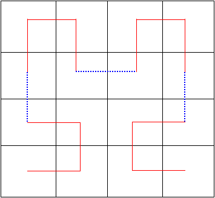

# deep-scurve
This repo is an investigation into doing tensor transformations using space-filling curves. 

## Basic introduction
A *space-filling curve* is a path through a grid which covers the entire grid. (These paths are called curves, but really only have right angles). The *Hilbert curve* follows this path through a 4x4 grid. 

Here is a simple 4x4 grid with the cells shuffled via this Hilbert curve.

This notebook walks through an explanation of how to capture neighborhoods of pixels in a way that is very friendly to deep learning. (The Colab link is better).

[colab](https://colab.research.google.com/github/LanceNorskog/deep-scurve/blob/master/notebooks/Hilbert_Mapping_Introduction.ipynb)
[github](notebooks/Hilbert_Mapping_Introduction.ipynb)

## Applications of Hilbert Space-Filling Curves to Image Processing

Illustrate how sequences of cells in a matrix become square and irregular clusters in the rearranged matrix. Open the Colab link.

[colab](https://colab.research.google.com/github/LanceNorskog/deep-scurve/blob/master/notebooks/Hilbert_Mapping_in_Image_Processing.ipynb)
[github](notebooks/Hilbert_Mapping_in_Image_Processing.ipynb)

Illustrate with animation of 8x8 grid, linear and Hilbert mapping as an image sampling algorithm

[github](Hilbert_Animation.md)

## Using Hilbert curve in simple deep learning task with MNIST digits

Simple deep learning experiment demonstrating how Hilbert rearrangement can assist in doing image processing.

[writeup](simple_deep_learning.md)

Open Colab link to see images or the Keras code.

[colab](https://colab.research.google.com/github/LanceNorskog/deep-scurve/blob/master/notebooks/Scurve_MNIST_Demo.ipynb)
[github](notebooks/Scurve_MNIST_Demo.ipynb)

## Acknowledgements
All of the IPython notebooks were written and debugged on Google's Colab free tier. The Hilbert curve code was lifted from Aldo Cortesi's [scurve](https://github.com/cortesi/scurve) package for Python. It is only released for Python 2, so I ~~hacked it up~~ ported it to Python 3. 

*(Colab: where some days are better than others ™)*
