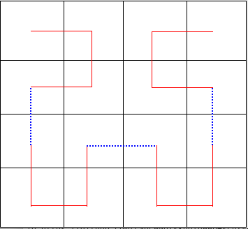
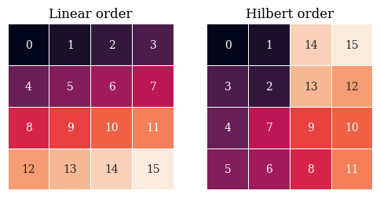

# deep-scurve
This repo is an investigation into doing matrix transformations using space-filling curves. 

A *space-filling curve* is a fully connected path through a grid which covers the entire grid and visits each cell only once. There are several kinds of space-filling curve (these paths are called curves, but really only have right angles). In this project we use the curve invented by David Hilbert. Roughly, the Hilbert curve is created by process a akin to making folded paper snowmen: fold a square surface twice into a smaller square, inscribe through all layers a cut to the edge, then unfold the surface. 

The *Hilbert curve* follows this path through a 4x4 grid. 

Here is a simple 4x4 grid with the cells shuffled via this Hilbert curve.

This shuffling operation is called a _function on a matrix_. It can be done on any matrix whose size is a power of 2.
This link shows the above shuffling process in more detail, including some math. 

[Introduction to Matrix Transformations with the Hilbert Space-Filling Curve](introduction.md)

## Applications of Hilbert Space-Filling Curves to Image Processing

This notebook illustrates how sequences of cells in a matrix become square and irregular clusters in the rearranged matrix. Open the Colab link.

[Colab](https://colab.research.google.com/github/LanceNorskog/deep-scurve/blob/master/notebooks/Hilbert_Mapping_in_Image_Processing.ipynb)
[github](notebooks/Hilbert_Mapping_in_Image_Processing.ipynb)

The following digression shows the above with some animations!

[Animations of Hilbert Shuffle](Hilbert_Animation.md)

## Using Hilbert curve in simple deep learning task

Here is a simple deep learning experiment demonstrating how this can assist in doing image processing.

[Deep Learning: using this on MNIST digits](simple_deep_learning.md)

## Other uses of the Hilbert space-filling curve in deep learning

In DNA analysis, DNA data is linear but overlapping combinations of nearby elements are very important. This paper shows how DNA data is visualized via Hilbert space-filling curves:

[Visualization of genomic data with the Hilbert curve](https://www.ncbi.nlm.nih.gov/pmc/articles/PMC2677744/)

and, a few projects in deep learning which fabricate a matrix or tensor using the Hilbert curve, and then apply image-processing techniques to try to analyze these "nearness" aspects:
[An image representation based convolutional network for DNA classification](https://openreview.net/pdf?id=HJvvRoe0W)

(Hilbert Vector Convolutional Neural Network: 2D Neural Network on 1D Data)[https://www.researchgate.net/publication/335699800_Hilbert_Vector_Convolutional_Neural_Network_2D_Neural_Network_on_1D_Data]

[CHilEnPred: CNN Model With Hilbert Curve Representation of DNA Sequence For Enhancer Prediction](https://www.researchgate.net/publication/331400697_CHilEnPred_CNN_Model_With_Hilbert_Curve_Representation_of_DNA_Sequence_For_Enhancer_Prediction)

This is the only use that I can find via a quick search of the literature. There don't seem to be any applications of space-filling curves to actual images or tensor data (image sequences, geology data). 

## Acknowledgements
All of the IPython notebooks were written and debugged on Google's Colab free tier.

*(Colab: where some days are better than others ™)*
