# Applications of Hilbert Space-Filling Curves to Image Processing

In a previous notebook, we demonstrated the concept of rearranging a matrix along the Hilbert Space-Filling Curve. In this notebook we will explain how to apply this operation to image processing. We will show how the self-similarity property of the Hilbert curve gives a very useful approach to sampling sections of an image, in particular to the way image processing works in deep learning.

Note that there are many space-filling curves. Empirical research has shown that the Hilbert curve is the best for our purposes. (See Appendix for links to research on this.)

## Hilbert space-filling curves as a matrix function

The following grids show how cells are numbered in a Hilbert path through an 8x8 grid. The left grid shows the conventional computer memory-based addressing. The right grid shows the path through the grid in cell order.

(These examples use an 8x8 grid to more completely display the interesting properties of neighborhood clusters in this technique.)

("Flyback" here refers to the distance between cells in memory. It is named for the "flyback transformer" found in cathode ray tubes. For more on this, [try out this wonderful tutorial](https://nationalmaglab.org/education/magnet-academy/watch-play/interactive/electromagnetic-deflection-in-a-cathode-ray-tube-ii).)

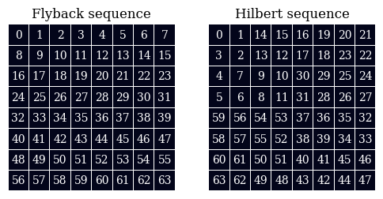

The Hilbert space-filling curve can be used as a function on a 2D matrix, which maps its cells to a new 2D matrix. This notebook illustrates this concept, and shows why it creates a useful method of sub-sampling neighborhoods in an image.

The following shows how sequences of cells in Flyback order are naturally clustered when mapped to Hilbert order. First, row-sized sequences and then somewhat randomized runs.

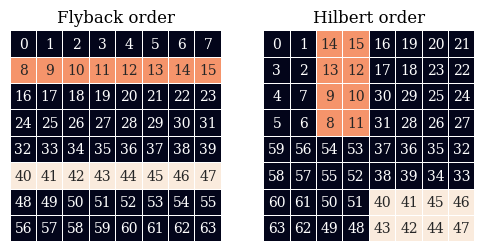

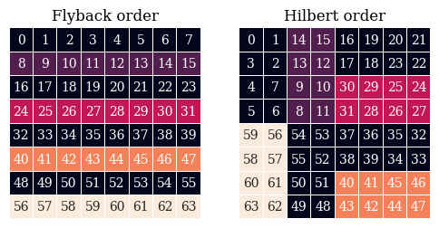

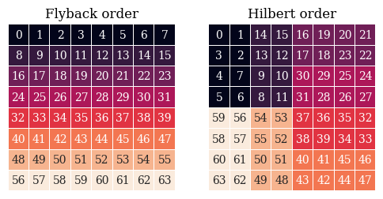

These sequences can be any range of cells in the matrix. That is, we can sample a row of cells which are not aligned to a power of 2.

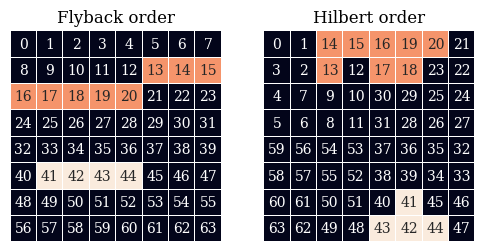

Obviously, these data subsets are not probabilistic samples- no coins were tossed, no dice were thrown. However, copying cells from the Flyback sequence to the corresponding Hilbert cluster is a form of sampling that looks suspiciously like probabilistic sampling.

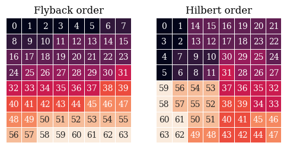

## Euclidean Distances of Flyback and Hilbert Matrices
These are [heatmaps](https://seaborn.pydata.org/examples/heatmap_annotation.html) of the Euclidean difference between all pairs of cells in the Flyback-ordered and Hilbert-ordered matrices, along the Flyback and Hilbert paths. On the left, Euclidean distances for the conventionally numbered matrix. On the right, the Euclidean distance between all pairs following the sequence of the space-filling curve. That is, on the left are the Euclidean distances for standard row order, and on the right are the Euclidean distances between two cells on the Hilbert path.
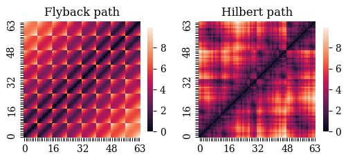

From the above right, we can see that the distance along the Hilbert path is (somewhat) correlated with the Euclidean distance between two points.

Next, we will divide the Flyback distances by the Hilbert distances.

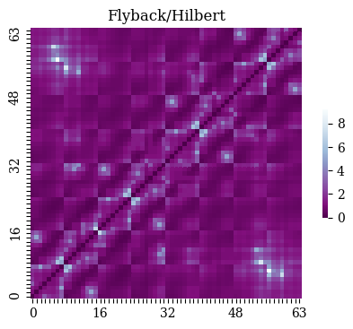

The mean value of the above ratio grid is higher than 1.0 (medium purple), but the median is just under, meaning that the Euclidean distance grid has more outliers. But really they're still very close. The maximum (white) is around 5.

## Cluster Size Distributions
Now, let's take a look at the sizes of these sampled clusters. We're going to map sequences of cells from Flyback to Hilbert order, and analyze the sizes of the resulting cell clusters. This dataset is a portrait of the locality of these 2-dimensional neighborhood samples.

Let's take this row-by-row sampling of an 8x8 grid when mapped to Hilbert space, and:
* calculate the centroid of the sample cluster
* calculate the Euclidean distance from each cell to the centroid.

First, a simple plot of these distances, with a grid for reference.

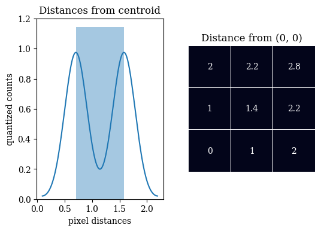

This is a scatter plot of the distances, with 2D information preserved.

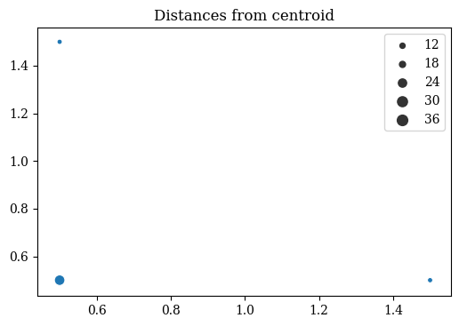

Next, we're going to march through the 8x8 cube one cell at a time, and collect the same measurements. That is, we're going to march a row of cells through the matrix in Flyback order, capture the positions of those cells in the Hilbert version of the matrix, and take the distance from the centroid of all 63 row-length. (Here are 6 examples of the 63 possible rows and their corresponding clusters. Black/dark blue squares are skipped)

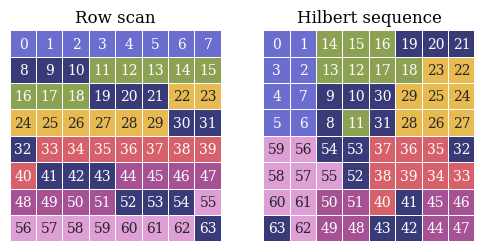

Note that the row-wise walk of the matrix (above) always creates clustered neighborhoods, while the off-power-of-2 walk often generates larger, sparser neighborhoods.
As a result, the row-wise walk distances are limited to below 2.5, while the off-register walk distances range to 5.

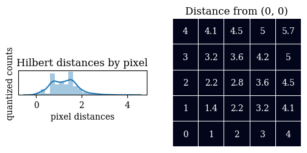

Let's do a scatterplot of this larger dataset, and since the data has lot more variation, we will also also a KDE (kernel density estimation) plot. The scatterplot is good for seeing the structure of outliers, while the KDE plot is a portrait of the main structure.

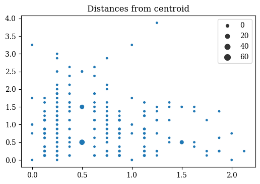

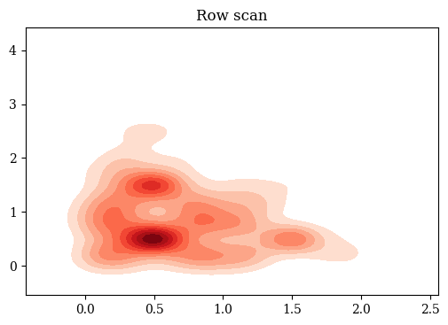

## Appendix: More on space-filling curves
There are many kinds of space-filling curve.
Empirical research has shown that the Hilbert curve has the best locality. Here are two such investigations:

[Analysis_of_the_Clustering_Properties_of_Hilbert_Space-filling_Curve](https://www.researchgate.net/publication/3296936_Analysis_of_the_Clustering_Properties_of_Hilbert_Space-filling_Curve)

[The Performance of Space-Filling Curves for Dimension Reduction](https://people.csail.mit.edu/jaffer/CNS/PSFCDR)

These images were all generated in a Colab notebook.

[Colab](https://colab.research.google.com/github/LanceNorskog/deep-scurve/blob/master/notebooks/Hilbert_Mapping_in_Image_Processing.ipynb)
[github](https://github.com/LanceNorskog/deep-scurve/blob/master/notebooks/Hilbert_Mapping_in_Image_Processing.ipynb)
