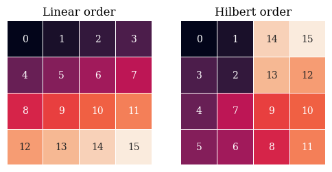
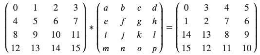

# Hilbert Space-Filling Curves

A space-filling curve is a path through a grid which covers the entire grid, and only touches each square once. There are various types of such paths. The Hilbert space-filling curve is one of a family of such paths. Unlike some space-filling curves, the Hilbert curve is self-similar (fractal).

[Good basic explanation of Hilbert space-filling curves](http://www.bic.mni.mcgill.ca/~mallar/CS-644B/hilbert.html)

[Dive into the deep end at Wikipedia](https://en.wikipedia.org/wiki/Hilbert_curve)

This page walks through how to use the Hilbert space-filling curve as a function on a tensor. This transformation has interesting properties for analyzing multi-dimensional data.

## Shuffling a Matrix with the Hilbert Space-Filling Curve
We can rearrange a square matrix using the Hilbert space-filling curve. The output matrix will have all but one of the squares in a new position, and each cell's value exists in the target matrix. Squares are not deleted or copied. (This is a one-to-one or bijective function.)

The following grids show how cells are numbered in a Hilbert path through a 4x4 grid. The left grid shows the conventional computer memory-based addressing. The right grid shows the path through the grid in cell order.

We start with the matrix in linear order...

... unrolls it into a 16-cell vector ...

... shuffles the contents of each cell to its place along the Hilbert curve...

... then reshapes the resulting vector back into a matrix.

In image-processing terms, this could be called the Hilbert Shuffle, the Space-filling curve shuffle, or (my favorite) the Fractal Scramble. Hilbert shape-filling curves are defined for all finite dimensions, and thus this shuffling operation can be applied to image, 3D voxel data, and any other (hyper-)cubic tensor.

## Fractal Nature of the Hilbert Space-filling Curve
Next, we're going to give each row a uniform color. Note that the rows are now assigned to quadrants. This is because the matrix transform rearranged the cells into square groupings. This illustrates the fact that the Hilbert path is self-similar: this square target is replicated at every power of 2.

## Hilbert Mapping as a Matrix Function
The Hilbert mapping can be directly expressed as a function on the unwrapped line in Step 2. Recall from basic linear algebra that the identity matrix is called this because it is the identity function on a vector.

The Hilbert mapping function, as a matrix, looks like the identity function shown above, except that the 1's are rearranged. (Given that this matrix has to turn a 16-cell vector into another 16-cell vector, it has to be a 16x16 matrix.)

Multiplying a 16-vector by the above Hilbert mapping function gives the rearranged 16-vector:

... multiply this linearized vector by the 16x16 "Hilbert Mapping" matrix above ...

For the three people reading this who like mathematical notation, we take this matrix...

express it as a 16-cell vector, multiply it by the above Hilbert mapping function matrix...

... and then wrap the resulting 16-cell vector as a 2D matrix:

One might assume that there also exists a 4x4 matrix which directly transforms the original matrix into the final.

Such a matrix is soluble for the 2x2 case: [Symbolab](https://www.symbolab.com/solver/matrix-multiply-calculator/solve%20for%20%5Cbegin%7Bpmatrix%7Da%26b%5C%5C%20%20%20%20c%26d%5Cend%7Bpmatrix%7D%2C%20%5Cbegin%7Bpmatrix%7D1%262%5C%5C%203%264%5Cend%7Bpmatrix%7D%5Cbegin%7Bpmatrix%7Da%26b%5C%5C%20c%26d%5Cend%7Bpmatrix%7D%20%3D%5Cbegin%7Bpmatrix%7D1%262%5C%5C%204%263%5Cend%7Bpmatrix%7D)

result:

However, the web site failed for the above 4x4 case: [Symbolab](https://www.symbolab.com/solver/matrix-multiply-calculator/solve%20for%20%5Cbegin%7Bpmatrix%7Da%26b%26c%26d%5C%5C%20%20%20e%26f%26g%26h%5C%5C%20%20%20i%26j%26k%26l%5C%5C%20%20%20m%26n%26o%26p%5Cend%7Bpmatrix%7D%2C%20%5Cbegin%7Bpmatrix%7D1%261%261%261%5C%5C%20%20%20%201%261%261%261%5C%5C%20%20%20%201%261%261%261%5C%5C%20%20%20%201%261%261%261%5Cend%7Bpmatrix%7D%5Ccdot%5Cbegin%7Bpmatrix%7Da%26b%26c%26d%5C%5C%20%20%20%20e%26f%26g%26h%5C%5C%20%20%20%20i%26j%26k%26l%5C%5C%20%20%20%20m%26n%26o%26p%5Cend%7Bpmatrix%7D%3D%5Cbegin%7Bpmatrix%7D1%261%261%261%5C%5C%20%20%201%261%261%261%5C%5C%20%20%201%261%261%261%5C%5C%20%20%201%261%261%261%5Cend%7Bpmatrix%7D)

Naive application of other equation-solving software has similarly met with failure, at this and a few other powers of 2. In general, this problem is probably not solvable with linear methods.

## Notebook
This markdown page is laboriously hand-transcribed from the following Colab notebook because there does not seem to be any software that will make a presentation from text and code output, while suppressing code blocks.

[Colab](https://colab.research.google.com/github/LanceNorskog/deep-scurve/blob/master/notebooks/Hilbert_Mapping_Introduction.ipynb)
[github](notebooks/Hilbert_Mapping_Introduction.ipynb)
