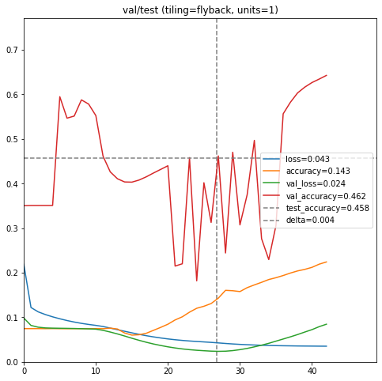

This Colab notebook runs experiments in training an autoencoder (written in Keras/Tensorflow) to regenerate MNIST digits. 

The Keras code uses the 'scurve' library to create a mapping for a 32x32 grid. 
MNIST digits are 28x28, so they are extended to 32x32.
The autoencoder takes the set of digits and:
1) feeds it one pixel at a time to an LSTM, 
2) feeds the output of the LSTM to another LSTM,
3) feeds the output of that LSTM to a Dense network using TimeDistributed,
4) which emits one pixel at a time as the output image.

There are 12 different experiments, 6 LSTM sizes v.s. with&without Hilbert rearrangement. 
They demonstrate conclusively that, at least in a limited design, Hilbert rearrangement causes a major improvement.

The training is done with three image sets: training, validation, and test. Training checks against the validation set after each epoch. The model is chosen from the lowest level of validation loss (not accuracy!). Training stops if, after 15 epochs, validation loss does not continue to decrease. (The nadir of validation loss is generally accepted as the crossover point between under- and over-training.) After training finishes, we evaluate the model on the second hold-out 'test' data. We save and graph the loss, accuracy, validation loss, validation accuracy, test loss and test accuracy here for the case of "1 units of LSTM, and no Hilbert rearrangement".

[colab](https://colab.research.google.com/github/LanceNorskog/deep-scurve/blob/master/notebooks/Scurve_MNIST_Demo.ipynb)

