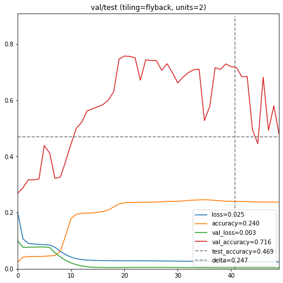

This Colab notebook runs experiments in training an autoencoder (written in Keras/Tensorflow) to regenerate MNIST digits using both linear matrix and Hilbert space-filling curves to feed a pair of LSTM nodes. 

## Model

The Keras code uses the 'scurve' library to create a mapping for a 32x32 grid. 
MNIST digits are 28x28, so they are extended to 32x32.
The autoencoder takes the set of digits and:
1) feeds it one pixel at a time to an LSTM, 
2) feeds the output of the LSTM to another LSTM,
3) feeds the output of that LSTM to a simple Dense Feed-Forward-Network,
4) which emits one pixel at a time as the output image.

## Training charts

The training is done with three image sets: training, validation, and test. Training checks against the validation set after each epoch. The model is chosen from the lowest level of validation loss (not accuracy!). Training stops if, after 15 epochs, validation loss does not continue to decrease. (The nadir of validation loss is generally accepted as the crossover point between under- and over-training.) After training finishes, we evaluate the model on the second hold-out 'test' data. We save and graph the loss, accuracy, validation loss, validation accuracy, test loss and test accuracy here.

How to read this: *loss*, *accuracy*, *val_loss*, *val_accuracy* should be familiar. *test_accuracy* is the accuracy made on the best version of the model against the second holdout 'test' dataset. The horizontal and vertical dashed lines are the final measure of the model: the vertical line as at the lowest value of validation loss, and the horizontal line is the accuracy value for the test data. Look at the distance between the red val_accuracy line and the dashed test_accuracy line- this is the measure of how bad the model is. 'delta' is the vertical distance between these two lines at the nadir of the validation loss. 

In a good model, this delta should be very small- the validation accuracy and test accuracy should be very very close. In this chart, the delta is huge because this model is terrible! The job of the LSTMs is to retain a running summary of the pixels recently fed into it, in order to auto encode each pixel. An LSTM with only two hidden neurons of internal state cannot retain much information about the recent pixels.

## Experiments

There are 12 different experiments, 6 LSTM sizes v.s. with&without Hilbert rearrangement. 
They demonstrate conclusively that Hilbert rearrangement can cause a major improvement. 

For readability, the following charts are stripped down to just val_loss, val_accuracy and test_accuracy. 

The tests were run with LSTM sizes of 1, 2, 4, 8, 16 and 32 units in the encoder & decoder LSTMs. This number is called the _receptive field_ of the LSTM model. These models are quite unstable, and at this size do not function very well even with the Hilbert rearrangement.

Moving up to 8 units, and especially 16 units, seems to work best for this test. 

For all 6 sizes, we can see that feeding the pixels to the LSTM in Hilbert space-filling curve order gives a more effective model that using the linear matrix order. 

## Digits
Let's look at the output of the autoencoder for different sizes of receptive field. First, the actual digits:

Then, autoencoder outputs from the fully trained network for sizes 1, 2, 4, and 8 for the linear mode:

Now, sizes 1, 2, 4, and 8 in Hilbert space-filling curve mode:

Clearly, these networks are very competent autoencoders even at the small sizes of receptive field. Now, let's look at the outputs of these networks with only 5 epochs worth of training. First, the original images:

This time we're going to alternate the linear mode and Hilbert mode. For the size of 1 unit, the linear mode doesn't work at all. (Notice the apparent VHS sync problem in the upper left corner!):

2 units, linear v.s. Hilbert at only 5 epochs. This shows that the minimal linear size does an OK job learning in an interpretable way, while the Hilbert version fills in blocks:

4 units, linear v.s. Hilbert at only 5 epochs. Both modes are useable but noisy:

8 units, linear v.s. Hilbert at only 5 epochs. Both modes are visually clean:

So, even though the receptive field should be 16 or 32 to create a solid, reliably trainable network, the smaller sizes show how the LSTM tools build a very effective view of local data.

## Conclusion
Based on the encouraging results from this obviously limited test, we will do further research.

[colab](https://colab.research.google.com/github/LanceNorskog/deep-scurve/blob/master/notebooks/Scurve_MNIST_Demo.ipynb)

